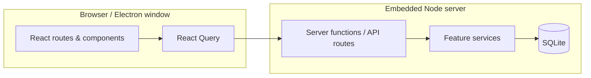

# Architecture

Sanctuary is a **local-first** TanStack Start application with an optional Electron shell.

## Stack

| Layer         | Technology                                                      |
| ------------- | --------------------------------------------------------------- |
| UI            | React 19, Tailwind CSS, Radix / Base UI                         |
| Routing & SSR | TanStack Router, TanStack Start                                 |
| Data          | TanStack Query, Drizzle ORM, SQLite (`better-sqlite3` / libsql) |
| Desktop       | Electron 34, electron-builder                                   |
| Tests         | Vitest                                                          |

## High-level flow



In **production desktop** mode, Electron forks `dist/server/server.js` and loads the UI from `http://127.0.0.1:<port>`.

## Directory layout

```
src/
  routes/           # TanStack Router pages (__app/, __root.tsx)
  components/       # UI by domain (journal/, habits/, layout/, ui/)
  features/         # Domain modules (schema, service, api, queries, …)
  database/         # Drizzle schema and initialization
  config/           # Branding and app constants
  test/             # Fixtures and in-memory DB helpers
drizzle/            # Generated SQL migrations
main.js             # Electron main process
electron-builder.yml
```

## Feature module pattern

Each domain under `src/features/<name>/` typically includes:

- `*.schema.ts` — Zod validation
- `*.service.ts` — business logic and database access
- `*.api.ts` — server functions exposed to the client
- `*.queries.ts` / `*.mutations.ts` — React Query integration
- `*.integration.test.ts` — database integration tests

## Naming conventions

| Kind                  | Convention    | Example                               |
| --------------------- | ------------- | ------------------------------------- |
| Product (user-facing) | **Sanctuary** | Window title, navbar                  |
| npm / GitHub repo id  | `sanctuary`   | `github.com/rajeshepili/sanctuary`    |
| Journal domain code   | `journal*`    | `journal.service.ts`, `JournalEditor` |
| Settings UI           | `Sanctuary*`  | `SanctuarySettings.tsx`               |
| Database tables       | `snake_case`  | `journal_entries`                     |

See [CONTRIBUTING.md](../CONTRIBUTING.md) for full contributor guidelines.
